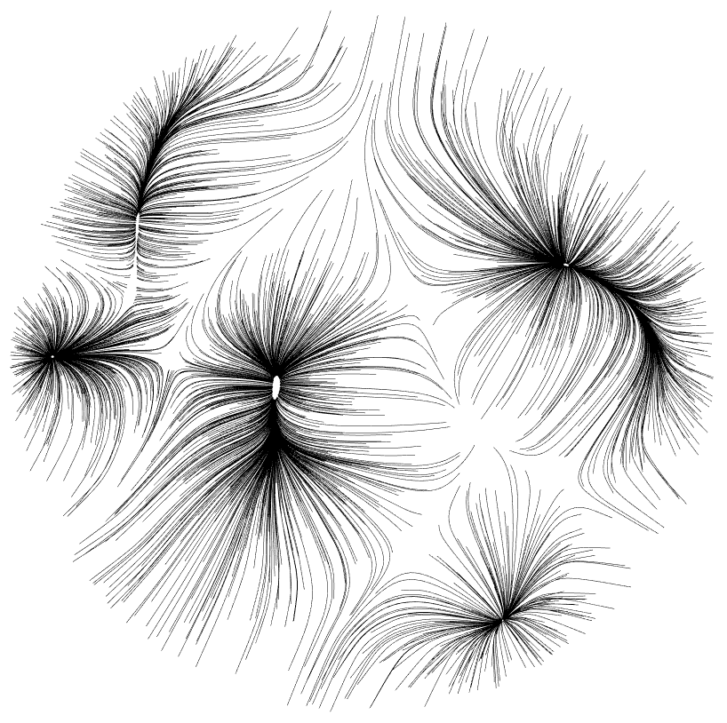

# meanshift-dense

Header-only mean-shift clustering algorithm for small point clouds with 
adaptive bandwidth.

This is a brute force implementation w/o discretization for efficient
processing of small datasets with n<1500 points of up to d<8 dimensions.
The class is self-contained, i.e. has no additional dependencies beyond std,
operates on raw data pointers and is header-only.

The main routine is `shift_points()` that implements mean-shift of a set of
test points against a density estimate of another set of data points. Note
that the routine does not compute a clustering/segmentation but outputs only
the mean-shifted test points that, in case the mean-shift algorithm has
converged, will accumulate at candidate positions for maximum modes of 
the density. 

Identification of stable modes (e.g. via perturbation analysis) and deriving 
a clustering from the result is up to the callee.

